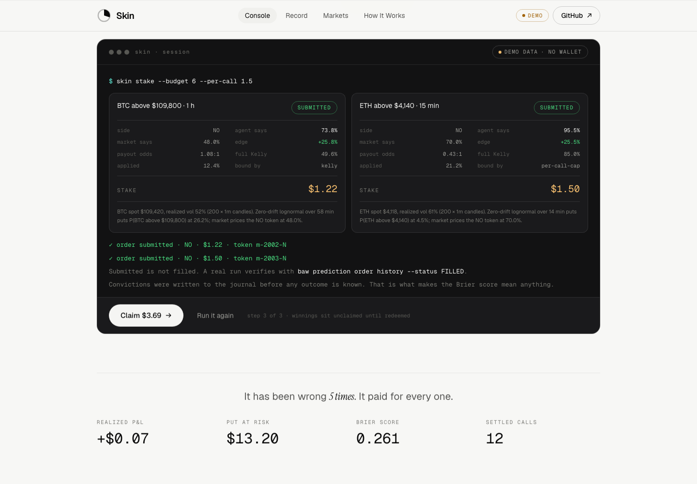
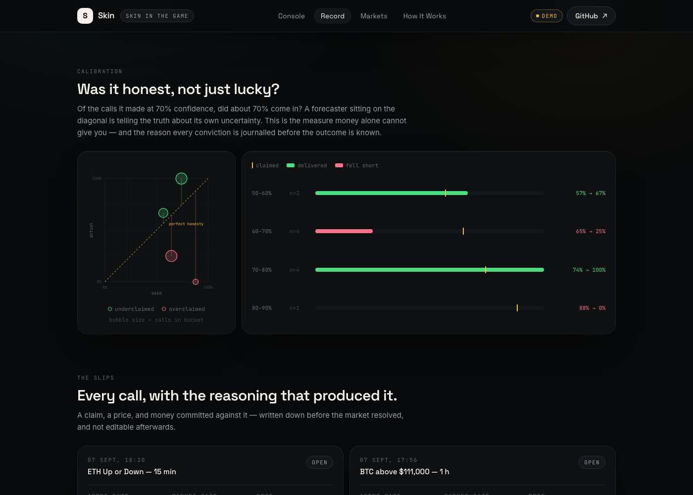
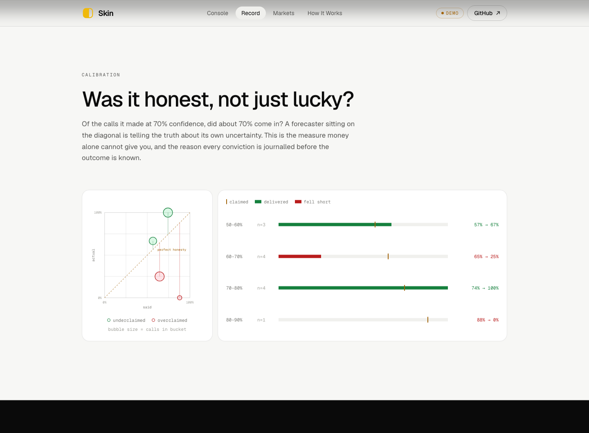
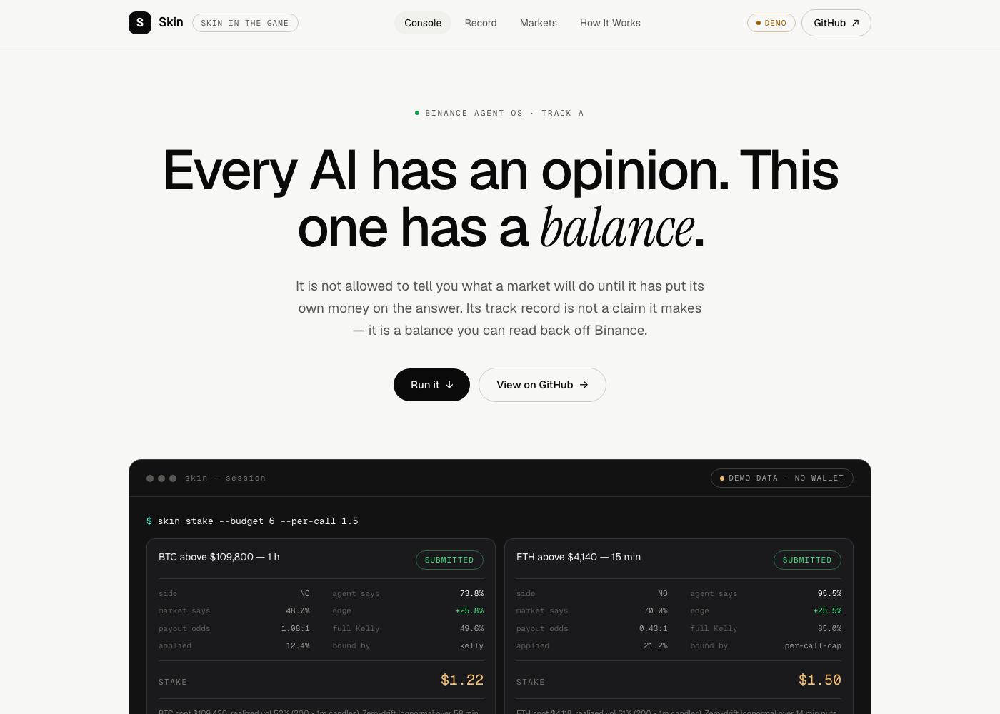

<div align="center">

# Skin

*skin in the game*

**An AI analyst that has to bet its own money on every call it makes.**

Its track record is not a claim it writes about itself.
It is settled positions on Binance prediction markets, scored with a rule it cannot game.

**[Live dashboard →](https://tryskin.vercel.app/)**

[](https://agent.binance.com)
[](https://github.com/binance/binance-skills-hub)
[](https://agent.binance.com/mcp/agentic)
[](https://github.com/martinvibes/skin-in-the-game/actions)
[](test/math.test.ts)
[](tsconfig.json)
[](LICENSE)

</div>

---

## The problem

Every AI agent will tell you what it thinks the market will do. None of them
pay for being wrong.

An agent can say *"BTC looks bullish, roughly 80% confidence"* a hundred times.
It is never scored, so the confidence number means nothing, and it costs
nothing to inflate. This is the single largest unsolved problem with AI
financial agents: **there is no price on being wrong**, so there is no
information in anything they say.

## The fix

Binance Agent OS shipped prediction markets to the Agentic Wallet. A prediction
market quotes belief directly: an outcome token at $0.62 *is* a 62% probability.
That makes it the only venue where an agent's forecast and its money can be the
same object.

So this agent is not allowed to have an opinion for free.

1. It reads a market and computes a probability from realized volatility: no
   LLM guess, a closed-form model anyone can recheck.
2. If it disagrees with the market by more than 4 points, it sizes a stake by
   the **Kelly criterion** and buys with real USDT.
3. Before the outcome is known, the conviction goes into an append-only journal.
4. When the market resolves, the result is scored by **Brier score**, a
   strictly proper rule, meaning the agent's best possible strategy is to state
   what it actually believes.
5. It sweeps its own winnings, because prediction markets do not pay out
   automatically and an agent that never claims goes broke while being right.

Every number on the dashboard traces back to a settled on-chain position.
**The agent does not get a vote in its own performance review.**

---

## Table of contents

- [What it looks like](#what-it-looks-like)
- [Quick start](#quick-start)
- [Binance Agent OS surfaces used](#binance-agent-os-surfaces-used)
  - [Using the MCP Server](#using-the-mcp-server)
- [Why it refuses](#why-it-refuses)
- [How the model works](#how-the-model-works)
- [Architecture](#architecture)
- [Repo layout](#repo-layout)
- [Commands](#commands)
- [Safety](#safety)
- [Testing](#testing)
- [For judges and reviewers](#for-judges-and-reviewers)
- [Honest limitations](#honest-limitations)

---

## What it looks like

[](https://skin-in-the-game-five.vercel.app)

The dashboard is not a report you scroll. It is the agent's loop with a button
on it. **Run a scan** prices five markets one at a time and says out loud why it
refuses most of them; **Stake** makes you type the word `stake` before any money
moves, exactly as the CLI does; **Claim** sweeps the winnings that prediction
markets do not pay out on their own. Every number in it comes from the `scan`
block of `record.json`, which the CLI produced by calling the same `formOpinion`
and `sizeStake` a live run calls, so the demo cannot quietly disagree with the
tool it is demonstrating.

### The record

```
  SKIN  skin in the game   ● DEMO  synthetic fixtures · no wallet, no money moved

THE RECORD
computed from settled positions · the agent does not get a vote
──────────────────────────────────────────────────────────────────────────
  realized PnL                +$0.07  on $13.20 staked
  return on stake               0.5%

  Brier score                  0.261  roughly as useful as always saying 50%
                                      0 perfect · 0.25 = always saying "50%" · lower is better

  settled calls                   12
  won / lost                   7 / 5
  hit rate                     58.3%
──────────────────────────────────────────────────────────────────────────
```

That is the bundled demo record, and it is deliberately **unflattering**: up
seven cents on $13.20, a Brier score barely better than a coin flip, and the
biggest single loss is the call it was 88% sure about. A demo that showed a
winning agent would be showing you the marketing, not the mechanism.

The point of the project is that this number is not editable. So it is not
edited.

### A betting slip

Every stake prints a receipt before any money moves: the full derivation, and
which of the four ceilings actually bound the size.

```
┌┄┄┄┄┄┄┄┄┄┄┄┄┄┄┄┄┄┄┄┄┄┄┄┄┄┄┄┄┄┄┄┄┄┄┄┄┄┄┄┄┄┄┄┄┄┄┄┄┄┄┄┄┄┄┄┄┄┄┄┄┄┄┄┄┄┄┄┄┄┄┄┄┐
┆ BTC above $109,800 · 1 h                                      PENDING  ┆
┆ side NO                                                                ┆
┆┄┄┄┄┄┄┄┄┄┄┄┄┄┄┄┄┄┄┄┄┄┄┄┄┄┄┄┄┄┄┄┄┄┄┄┄┄┄┄┄┄┄┄┄┄┄┄┄┄┄┄┄┄┄┄┄┄┄┄┄┄┄┄┄┄┄┄┄┄┄┄┄┆
┆ agent says            73.8%                                            ┆
┆ market says           48.0%                                            ┆
┆ edge                  25.8%                                            ┆
┆ payout odds           1.08:1                                           ┆
┆ full Kelly            49.6%                                            ┆
┆ applied (¼ Kelly)     12.4%                                            ┆
┆ bound by              kelly                                            ┆
┆┄┄┄┄┄┄┄┄┄┄┄┄┄┄┄┄┄┄┄┄┄┄┄┄┄┄┄┄┄┄┄┄┄┄┄┄┄┄┄┄┄┄┄┄┄┄┄┄┄┄┄┄┄┄┄┄┄┄┄┄┄┄┄┄┄┄┄┄┄┄┄┄┆
┆ STAKE                 $1.22                                            ┆
┆┄┄┄┄┄┄┄┄┄┄┄┄┄┄┄┄┄┄┄┄┄┄┄┄┄┄┄┄┄┄┄┄┄┄┄┄┄┄┄┄┄┄┄┄┄┄┄┄┄┄┄┄┄┄┄┄┄┄┄┄┄┄┄┄┄┄┄┄┄┄┄┄┆
┆ BTC spot $109,420, realized vol 52% (200 × 1m candles). Zero-drift     ┆
┆ lognormal over 58 min puts P(BTC above $109,800) at 26.2%; market      ┆
┆ prices the NO token at 48.0%.                                          ┆
└┄┄┄┄┄┄┄┄┄┄┄┄┄┄┄┄┄┄┄┄┄┄┄┄┄┄┄┄┄┄┄┄┄┄┄┄┄┄┄┄┄┄┄┄┄┄┄┄┄┄┄┄┄┄┄┄┄┄┄┄┄┄┄┄┄┄┄┄┄┄┄┄┘
```

### A scan

Three of these five markets are refused. That is the system working.

```
SCAN
5 market(s) · bankroll $9.83 · run cap $6.00 · ¼ Kelly
──────────────────────────────────────────────────────────────────────────
  pass      BTC Up or Down · 5 min                    50% vs 50% · no-edge
  BET       BTC above $109,800 · 1 h                  74% vs 48% · $1.22
  BET       ETH above $4,140 · 15 min                 95% vs 70% · $1.50
  pass      SOL above $204 · 1 h                      65% vs 58% · below-minimum
  pass      BNB above $872 · 4 h                      54% vs 52% · no-edge
──────────────────────────────────────────────────────────────────────────
```

### The dashboard

**[skin-in-the-game-five.vercel.app](https://skin-in-the-game-five.vercel.app)**

A React page rendering the same `record.json` the CLI exports: the interactive
console, then the equity curve split at zero, a reliability diagram, the slips,
and the ledger. No backend: the page reads one file, so what it shows is exactly
what `skin export` produced. The mode badge in the header is permanent, so a
demo number can never be mistaken for a live one.



The equity area is clipped at zero, green above and red below, because the
one question anyone asks of that chart is *"is it above or below the line?"*,
and that should be answerable from across a room.



The reliability diagram plots stated confidence against what actually happened;
the amber diagonal is perfect honesty, and a bubble's area is the number of
calls in that bucket, so a single outlier cannot be mistaken for a trend. The
bars beside it say the same thing in words for anyone who does not read scatter
plots: what it claimed, what it delivered, and by how much it missed.



Every call is a betting slip carrying the reasoning that produced it, stamped
with what happened. Both charts are hand-drawn SVG, with no charting library,
because each has a reference line a generic library fights you to draw, and the
whole page gzips to 68 kB.

```bash
npm run web:dev
```

<details>
<summary>Deploying it yourself</summary>

The dashboard lives in `web/`, and this repo has **two** `package.json` files:
the CLI's at the root and the web app's in `web/`. Set the Vercel project's
**Root Directory to `web`**, or the build runs the root `package.json`'s
`build` script (`tsc -p tsconfig.json`, which compiles the CLI) and deploys
nothing servable. The symptom is a successful build followed by a 404 on every
route. [`web/vercel.json`](web/vercel.json) supplies the rest.

</details>

---

## Quick start

**No wallet, no money, no signup.** The demo path is fully offline and is what
a reviewer should run first:

```bash
git clone https://github.com/martinvibes/skin-in-the-game
cd skin-in-the-game
npm install

npm run skin -- record --demo     # the track record
npm run skin -- scan   --demo     # opinions, no money
npm run skin -- stake  --demo     # receipts + typed confirmation
npm run skin -- claim  --demo     # sweep unclaimed winnings
npm test                          # 49 unit tests
```

The dashboard:

```bash
npm --prefix web install
npm run web:dev
```

### Going live

Live mode needs a Binance **MPC Wallet** (created in the Binance mobile app;
an agent cannot create one for you) and a small USDT balance on BSC. Stakes are
about $1; $10–15 is enough to run this for real.

```bash
# 1. Install the Agentic Wallet skill
npx skills add binance/binance-skills-hub/skills/binance-web3/binance-agentic-wallet

# 2. In your agent: "Sign in to Binance Agentic Wallet", approve on your phone

# 3. Optional: connect the MCP Server for market data
claude mcp add binance-mcp-server --transport http https://agent.binance.com/mcp/agentic

# 4. Run for real
npm run skin -- record --live
npm run skin -- stake  --live --budget 6 --per-call 1.5
```

`skin` auto-detects: if `baw` is on your PATH it goes live, otherwise it falls
back to demo and says so in the banner. `--live` forces the real path and fails
loudly rather than silently pretending.

---

## Binance Agent OS surfaces used

| Surface | How this project uses it |
|---|---|
| **Agentic Wallet (`baw`)** | The entire trading path. `prediction market list / detail / last-trade-price` to read markets, `prediction trade place-order` to stake, `prediction trade redeem` to claim, `prediction position list --tab ONGOING\|PENDING_CLAIM` and `settled-history` to build the record, `wallet balance` for the bankroll. See [`src/adapters/baw.ts`](src/adapters/baw.ts). |
| **Binance MCP Server** | Market data for the pricing model. An MCP-authenticated agent fetches klines and hands them over with `--mcp-data`, so volatility is computed under the user's own Agent OS session. See [`src/adapters/marketdata.ts`](src/adapters/marketdata.ts) and [the walk-through below](#using-the-mcp-server). |
| **Skills Hub format** | [`skill/SKILL.md`](skill/SKILL.md) is a publishable skill in the Hub's frontmatter format, with a `references/` split. It is what turns the CLI into an agent workflow: a policy the agent has to follow, not just a binary it can call. |
| **MPC Wallet limits** | The wallet's own daily spend limit is read and treated as a hard ceiling on sizing, so the agent is *structurally* unable to exceed a boundary the human set in the Binance app. |

The wallet's daily limit as a sizing input is the part worth pausing on. Most
agent projects treat wallet limits as an error to handle. Here it is one of the
four terms in the position-sizing minimum, on equal footing with Kelly.

### Using the MCP Server

Connect it once:

```bash
claude mcp add binance-mcp-server --transport http https://agent.binance.com/mcp/agentic
```

Then the agent fetches candles under its own authenticated session, writes them
to a file, and hands the path over:

```json
{
  "BTCUSDT": { "interval": "1m", "closes": [109380.2, 109412.5, "…200 closes"] },
  "ETHUSDT": { "interval": "1m", "closes": ["…"] }
}
```

```bash
skin scan --mcp-data ./klines.json
```

A committed fixture lets you exercise that path right now, with no MCP session
and no network:

```bash
npm run skin -- scan --demo --mcp-data fixtures/klines.example.json
```

```
  pass      BTC Up or Down · 5 min                    50% vs 50% · no-edge
  BET       BTC above $109,800 · 1 h                  73% vs 48% · $1.18
  BET       ETH above $4,140 · 15 min                 96% vs 70% · $1.50
  pass      SOL above $204 · 1 h                      50% vs 42% · below-minimum
  pass      BNB above $872 · 4 h                      50% vs 48% · no-edge
```

Two of those markets have a strike sitting exactly on spot, and the model
prices both at exactly 50%, the cheapest available check that the lognormal is
wired up correctly. At the money, over any horizon, a zero-drift walk is a coin
flip.

Without `--mcp-data` the CLI falls back to Binance's public market-data REST
endpoint, which needs no credentials. Same arithmetic either way; the MCP path
is the one that runs inside the user's Agent OS session. It tries four hosts in
order, including `data-api.binance.vision`, because `api.binance.com` does not
resolve from every country this was developed in.

---

## Why it refuses

Money moves only if a call survives all five checks. Each one has a single job,
and each produces a named verdict rather than a silent skip.

| # | Check | Rejects |
|---|---|---|
| 1 | **Model** | A market whose title cannot be parsed, or with too little price history to measure volatility → `no-price` |
| 2 | **Edge** | Disagreement with the market smaller than 4 points → `no-edge` |
| 3 | **Bounds** | Conviction outside `[0.02, 0.98]`, where the model's own error exceeds its claimed edge → `conviction-bounds` |
| 4 | **Sizing** | Quarter-Kelly stake below the venue minimum → `below-minimum`. Never rounded up. |
| 5 | **Budget** | Run cap or the wallet's daily limit already spent → `budget-exhausted` |

**A scan where nothing clears is a successful scan.** The demo fixtures are
tuned so all five verdicts are reachable, because a gate you cannot see fire is
a gate you cannot trust.

---

## How the model works

No language model touches this path. Everything is computed, so it can be
rechecked.

**Pricing.** Threshold markets are barrier questions with a standard answer.
Assume zero-drift geometric Brownian motion:

```
P(S_T > K) = Φ(d₂)        d₂ = [ln(S/K) − σ²T/2] / (σ√T)
```

Zero drift is the honest assumption. Over a 5-minute horizon any drift you
could estimate is swamped by noise, and assuming one is exactly how forecasters
talk themselves into positions. μ = 0 makes the price a martingale and leaves
volatility as the only real input.

**Volatility.** Realized, from log returns of 1-minute klines, annualised.
Under 10 returns it returns `null` and the market is declined, because a model that
always produces an answer is a model that sometimes lies.

**Sizing.** Kelly, for a binary token bought at cost `c`:

```
b  = (1 − c) / c
f* = p − (1 − p)·c/(1 − c)
```

`f*` is zero exactly at `p = c`, so agreeing with the market produces a zero
bet with no special-case rule. **Quarter-Kelly** by default: full Kelly is only
optimal if `p` is exactly right, and `p` is a model output. Kelly is brutal
under overestimated edge, and the edge estimate is the least reliable term in
the equation.

**Scoring.** Brier score, `(1/N)·Σ(conviction − actual)²`. It is *strictly
proper*: minimised only by reporting true beliefs. The agent cannot improve it
by sounding confident and cannot improve it by hedging to 50%. It returns
`null`, never `0`, when there is nothing to score, since zero would read as perfect.

Full derivations in [`skill/references/model.md`](skill/references/model.md).

---

## Architecture

```
                      ┌──────────────────────────────┐
   Binance MCP  ─────▶│  marketdata.ts               │
   (klines)           │  realized volatility         │
                      └──────────────┬───────────────┘
                                     ▼
                      ┌──────────────────────────────┐
                      │  analyst.ts    P(S>K) = Φ(d₂)│──▶ conviction
                      └──────────────┬───────────────┘
                                     ▼
   baw prediction ───▶┌──────────────────────────────┐
   market list        │  sizing.ts   Kelly + 4 caps  │──▶ stake or decline
                      └──────────────┬───────────────┘
                                     ▼
                      ┌──────────────────────────────┐
                      │  journal.jsonl (append-only) │  ◀── written BEFORE
                      └──────────────┬───────────────┘       the outcome
                                     ▼
   baw trade      ◀───┌──────────────────────────────┐
   place-order        │  cli/index.ts                │
   redeem             └──────────────┬───────────────┘
                                     ▼
   baw position   ───▶┌──────────────────────────────┐
   settled-history    │  record.ts  Brier + calib.   │──▶ record.json ──▶ web
                      └──────────────────────────────┘
```

Three layers, and the boundary between them is enforced, not aspirational:

- **`adapters/`**: everything that touches the outside world. Processes,
  HTTP, the filesystem. All failure lives here.
- **`engine/`**: pure and total. No I/O, no clock, no randomness, no network.
  This is why 49 unit tests are worth something.
- **`cli/`**: rendering and confirmation. Formats; never computes.

The `PredictionClient` interface is the seam. `LiveClient` shells out to `baw`;
`DemoClient` returns fixtures. Nothing above the seam knows which it has,
which is what makes the demo path a real exercise of the code rather than a
mock of it.

---

## Repo layout

```
src/
  domain/types.ts        the vocabulary: Call → StakeVerdict → Position → Record
  adapters/
    exec.ts              execFile-based process runner (never a shell string)
    baw.ts               Agentic Wallet client + defensive JSON pickers
    marketdata.ts        REST / MCP / static kline sources, realized vol
    demo.ts              12 settled fixtures + 5 markets, all five verdicts
  engine/
    analyst.ts           erf, Φ, P(S>K), market-title parsing
    sizing.ts            Kelly, edge, the four ceilings
    record.ts            Brier, calibration bins, equity curve
    journal.ts           append-only JSONL, first-write-wins
  cli/
    index.ts             record | scan | stake | claim | positions | export
    render.ts            receipts, ledgers, sparklines, ANSI-aware padding

skill/
  SKILL.md               the Agent OS skill · the policy the agent follows
  references/            command surface + model derivations

web/                     Vite + React dashboard ("Ledger Noir")
fixtures/                a klines payload for exercising the --mcp-data path
docs/                    dashboard screenshots used by this README
test/math.test.ts        49 tests over the pure engine
```

~3,300 lines of TypeScript, `strict` with `noUncheckedIndexedAccess`.

---

## Commands

| Command | Money | What it does |
|---|---|---|
| `skin record` | — | Realized PnL, Brier, hit rate, ledger, equity, calibration |
| `skin scan` | — | Form opinions on live markets, commit nothing |
| `skin stake` | **spends** | Scan, print receipts, place orders after typed confirmation |
| `skin claim` | **moves** | Redeem settled winnings after typed confirmation |
| `skin positions` | — | What is still open, with time to resolution |
| `skin export` | — | Dump the record as JSON for the dashboard |

Flags: `--demo --live --yes --json --budget --per-call --kelly --min-order --limit --mcp-data --out`.
Full reference: [`skill/references/commands.md`](skill/references/commands.md).

---

## Safety

This spends real money from a real wallet, so:

- **Typed confirmation.** `stake` and `claim` require the whole word typed.
  `y` is rejected. On a non-TTY they refuse outright unless `--yes` was passed,
  and `--yes` announces itself in the output.
- **No shell strings.** [`exec.ts`](src/adapters/exec.ts) uses `execFile` with
  an argv array. A market title cannot become a command.
- **Market titles are never sent to a model.** They are attacker-controlled
  text from a public venue. They are parsed by regex and rendered as data. This
  removes the prompt-injection surface rather than trying to filter it.
- **The wallet's daily limit is a sizing input**, not an error to handle. The
  agent cannot raise it; that lives in the Binance app.
- **Errors are reported verbatim.** [`BawError`](src/adapters/exec.ts) carries
  the CLI's own words. A wallet error is never paraphrased into a guess.
- **Nulls are never defaulted.** A missing price is `null` and produces a
  decline. It never silently becomes `0`, which would read as a 100% edge.
- **The journal is append-only, first-write-wins.** Editing it is the one way
  to make the Brier score meaningless, which is why re-recording a token is
  refused rather than overwritten.

---

## Testing

```bash
npm test          # 49 tests
npm run typecheck # tsc --noEmit, strict
```

The tests cover the mathematics, not the plumbing: `erf` against known values,
`Φ` symmetry, Kelly against hand-computed cases, the zero-at-`p=c` property,
which ceiling binds in each regime, Brier against textbook examples, the
`null`-not-`0` rule, calibration bucketing, and equity accumulation.

[CI](.github/workflows/ci.yml) runs all of that on every push, plus a smoke test
that executes every command in demo mode on a clean machine, with no wallet, no
network, no journal in `$HOME`. It also re-exports `web/public/record.json` and
fails if it differs from the committed copy, so the dashboard payload can never
quietly drift from the fixtures that are supposed to produce it.

One of them caught a real bug: `parseClaim('BTC Up or Down · 5 min')` returned
`'below'`, because the `below` pattern was tested first and matched the word
*"Down"*. That silently inverted every two-sided short-duration market, most
of the tradable universe. It is fixed, and the test that found it is
[`test/math.test.ts`](test/math.test.ts).

---

## For judges and reviewers

Five minutes, in order:

1. **`npm install && npm run skin -- record --demo`**: the whole thesis in one
   screen. Note that the demo agent is barely profitable and has a mediocre
   Brier score. That is on purpose.
2. **`npm run skin -- scan --demo`**: three of five markets refused, each with
   a named reason.
3. **`npm run skin -- stake --demo`**: the receipt, and the typed
   confirmation. Try typing `y`; it will not accept it.
4. **[`src/engine/sizing.ts`](src/engine/sizing.ts)**: ~120 lines, the heart of
   the project. Four ceilings, the tightest binds, the binding one is named in
   the output.
5. **[`skill/SKILL.md`](skill/SKILL.md)**: the Agent OS skill, including the
   rule the agent is bound by: *it does not get to state an opinion about a
   market without backing it.*

What is genuinely different here, stated plainly: this is the only entry we are
aware of where the agent's **track record is adversarially verifiable**. You do
not have to trust the dashboard, the README, or the agent. The positions are
on-chain and the scoring rule is strictly proper. If the agent were lying about
its confidence, the Brier score would get worse, and the Brier score is the
number it is judged on.

---

## Honest limitations

Written before anyone asks.

- **The model is simple by choice.** Zero-drift lognormal on realized vol. It
  has no view on order flow, funding, news, or microstructure. It will be
  systematically wrong around scheduled events. A better model would improve
  the PnL; it would not change what the project demonstrates.
- **Track record length.** Brier over a dozen calls is indicative, not
  conclusive. The CLI says so itself: under five scored calls it prints *"too
  few to judge"* instead of a verdict.
- **Fees and slippage** are inside the realized PnL because it is computed from
  settled positions, but they are not modelled *ahead* of a trade. On $1 stakes
  the effect is small; at size it would need to enter the edge threshold.
- **Orders are submitted, not filled.** `place-order` returning success means
  accepted. The CLI says this and points at `baw prediction order history
  --status FILLED`.
- **Journal integrity is local.** Append-only and first-write-wins, but it is a
  file on the operator's machine. Anchoring a hash on-chain would make it
  externally verifiable; the settled positions already are.

---

## License

MIT. See [LICENSE](LICENSE).

Built for the **Binance Agent OS Mini Hackathon**, Track A.
